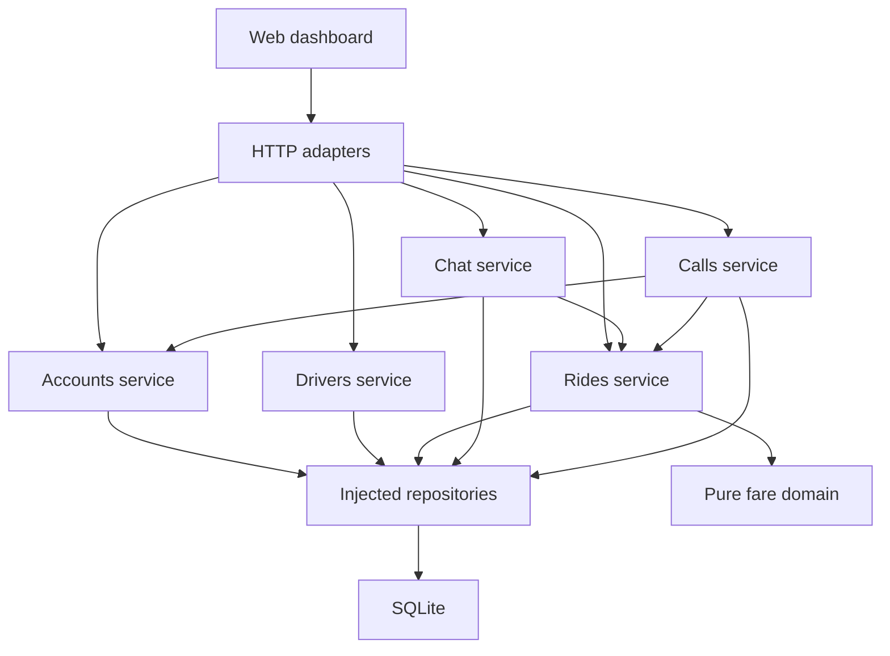

# Taxi Ai architecture

Taxi Ai uses a **modular monolith**: one backend process and database, with
separate business modules and explicit dependencies. The current code implements
accounts, driver review, ride/fare negotiation, trip lifecycle, participant chat
and audio calling, route quotes, driver location sharing, availability/nearby matching and simulated payments/receipts/earnings. The structure supports adding Eats and courier workflows
without mixing their rules into ride logic.
See [ADR 0001](decisions/0001-modular-monolith.md) for the decision and tradeoffs.

The target product is now one app and website with Customer, Drive & deliver
and My store modes. This is planned in [ADR 0002](decisions/0002-unified-app-and-multi-role-accounts.md)
and the [unified platform design](unified-platform.md). The account foundation
now implements Customer/Work on the website. [Schema 10](unified-accounts.md) adds
capabilities while preserving legacy identities, review evidence and sessions.

## Implemented modules

| Module | Responsibility | Owns |
| --- | --- | --- |
| Accounts | Registration, authentication, sessions, first-admin setup, own profile and driver enrollment | `users`, `sessions`, `account_capabilities`, `account_commands` |
| Drivers | Private applications, documents, manual review and expiry eligibility | `drivers`, `driver_applications`, `driver_documents`, `driver_document_reads`, `driver_application_events`, `driver_application_commands` |
| Rides | Requests, fares, bookings, pickup verification, progress, cancellation and history | `rides`, `fare_events`, `idempotency`, `ride_trips`, `ride_activity` |
| Chat | Participant messages, read markers, retries and reports | `chat_messages`, `chat_reads`, `chat_commands`, `chat_reports` |
| Calls | Audio invitations, session/window ownership, signaling, expiry and history | `voice_calls`, `voice_participants`, `voice_commands` |
| Locations | Provider-backed route quotes, fare suggestions, driver sharing and expiry | `location_quotes`, `location_quote_commands`, `location_shares`, `location_share_commands` |
| Availability | Driver Online/Offline, separate location consent, freshness and lease expiry | `driver_availability`, `availability_commands` |
| Payments | Completed-trip simulated payments, attempts, receipts and earnings summaries | `payments`, `payment_attempts`, `payment_receipts`, `payment_commands` |
| Shared domain | Pure fare state machine, lifecycle vocabulary, money, coordinate helpers and sample quotes | No storage or network |
| Infrastructure | SQLite, migrations, password hashing, random tokens, audit and rate limits | `audit_events`, `rate_limits`, connection lifecycle |
| HTTP | Route dispatch, request parsing, cookies, CSRF and error/status translation | No business state |

Every feature lives under `services/api/src/modules/<feature>/`:

- `service.mjs` implements use cases and authorization, receiving dependencies as
  factory arguments. It contains no SQL or HTTP objects.
- `repository.mjs` owns feature SQL and returns plain records. It participates in
  the caller's transaction and never commits independently.
- `routes.mjs` adapts HTTP inputs/results to an injected service. The shared router
  performs session, Origin/CSRF, body-size and rate-limit checks.
- `domain.mjs`, where useful, contains pure feature rules. The rides module uses
  it to check participants/versions and reconstruct the shared fare model.

`services/api/src/application.mjs` creates and connects services, repositories and
adapters. It is the only composition root. Business modules do not import one
another's internals. For example, rides receives a `getAccount(id)` port; account
registration receives driver-profile `find`/`insert` operations. The shared
transaction spans user and driver creation. Dependencies are plain functions and
objects, without a dependency-injection framework or service locator.

The runtime relationships are:

Arrows represent calls, not permission to import an implementation. The
composition root supplies dependencies. Authentication is session based; passing
a user ID from the browser never grants access to that user's account or ride.

## Commands, persistence and consistency

Requests progress from `requested` to `negotiating` to `agreed`. The customer then
confirms a booking. Its driver records on-way/arrival, starts with the pickup PIN
and completes the trip. Pre-start cancellation preserves any agreed fare.
See [the trip contract](trips.md) for availability, transitions and PIN handling.
These are test journeys; the homepage demo remains an independent in-memory example.

For each authenticated ride mutation, the service:

1. Validates the command key and begins a synchronous unit of work.
2. Reloads the actor, checks a previous key's command fingerprint, or validates
   permissions and the current ride version.
3. Applies the command using server time and the pure fare rules.
4. Writes the ride, fare event when applicable, audit event and retry key together.
5. Returns a projection only after the transaction succeeds. Persistence failures
   roll back all these writes. Incorrect PIN submissions instead commit their
   failure counter, audit reference and failed-command key before returning a
   validation error; retrying one cannot count as a second guess.

The SQLite adapter uses `BEGIN IMMEDIATE`, foreign keys and unique constraints for
one open request per customer, one active negotiation per driver and one active
trip per participant. Service checks also prevent mixing an active trip with a
new request/negotiation under the same transaction. A replayed
key returns the current saved ride; a different command with that key is rejected.
Rate-limit counters are intentionally a separate transaction so failed attempts
still count. Expensive password work runs outside transactions.

Repository operations and `unitOfWork(callback)` are synchronous contracts in
this version. Async callbacks and promise results are rejected; never schedule
background writes inside them. A future PostgreSQL adapter requires coordinated
async contract changes, migration and transaction/concurrency tests. Changing the
repository constructor alone is insufficient.

The existing `data/taxi-ai.sqlite` location is preserved. Ordered migrations
`002_chat.sql`, `003_trip_lifecycle.sql`, `004_voice_calls.sql` and
`005_locations.sql`, `006_matching.sql`, `007_payments.sql`, `008_driver_onboarding.sql`
and `009_trip_safety.sql`, followed by `010_account_capabilities.sql`, advance
the current schema to 10 without resetting
records or silently booking prior agreements. Older binaries refuse the upgraded
database. Local data and secrets are excluded from Git and static serving.
See [API notes](../services/api/README.md) for routes and current security limits.

## Fare rules

`packages/shared/src/fare-negotiation.mjs` models one customer/driver pair in
`open`, `agreed` or `cancelled` state. Every mutation checks the participant and
expected version. Every counteroffer has a new offer ID. Acceptance requires the
current offer ID/version, an unexpired offer and the other person's explicit
consent. Returned snapshots are copies, not mutable internal state.

Amounts are positive safe integer kobo. Suggestions are nonbinding; sample quotes
are fictional. Route quotes use an explicit illustrative formula, not an AI
estimator or a validated Abuja market rate. Server-persisted events reconstruct the fare
model; clients cannot upload snapshots or set event clocks. Ride versions also
include claiming/cancelling before a fare conversation; fare-event versions track
only the shared model. Their distinct sequences are validated separately.

The domain's `in_app`, `chat` and `voice_call` labels describe where an offer began;
they do not themselves implement communication. The current chat presents fare
cards and calls the same in-app offer/accept endpoints. Free text never changes
the fare. Voice calls also leave fares unchanged; both people must use the
existing offer/accept controls after discussing a price.

## Web and future mobile clients

The website uses native HTML/CSS/JavaScript. `apps/web/server.mjs` composes the
application/router and serves an explicit static allowlist. It defaults to loopback;
staging uses an authenticated HTTPS gateway and one configured origin.
At `/app`, `dashboard.mjs` wires DOM and feature adapters. The injected page
controller coordinates session state, dashboard reads and actions:

| Client module | Responsibility |
| --- | --- |
| `dashboard/api-client.mjs` | Same-origin requests, CSRF, timeout and stable retry keys |
| `dashboard/page-controller.mjs` | Account/session boundaries, coherent dashboard refreshes and queued-action guards |
| `dashboard/auth-form.mjs` | Login/registration form state and input collection |
| `dashboard/views.mjs` | Role-specific rendering and user action callbacks |
| `dashboard/conversation-controller.mjs` | Chat pagination, selected-account isolation and read acknowledgement |
| `dashboard/conversation-view.mjs` | Plain-text transcript, fare cards, drafts and reporting form |
| `dashboard/conversation-model.mjs` | Pure timeline and offer-card presentation rules |
| `dashboard/chat-reports-view.mjs` | Administrator view of reported messages |
| `dashboard/call-controller.mjs` | Call polling, explicit microphone consent, session isolation and cleanup |
| `dashboard/call-media.mjs` | Browser WebRTC, audio tracks and bounded ICE gathering |
| `dashboard/call-view.mjs` | Call controls, audio playback and recent call history |
| `dashboard/location-planner.mjs` | Explicit online consent, manual search, selected points and saved route quotes |
| `dashboard/location-sharing.mjs` | Driver GPS lifecycle, session/window isolation and bounded updates |
| `dashboard/availability-controller.mjs` | Separate availability consent, GPS/sample updates and lifecycle |
| `dashboard/availability-view.mjs` | Online/Offline and local sample-area controls |
| `dashboard/geolocation.mjs` | Browser permission and device location adapter |
| `dashboard/location-view.mjs` | Route forms, fare details and sharing controls |
| `dashboard/map-view.mjs` | Visible raster tiles, SVG routes/pins and keyboard map interaction |
| `dashboard/payments-controller.mjs` | Isolated payment/receipt requests and paged driver/admin records |
| `dashboard/payments-view.mjs` | Simulation controls, printable receipts and exact totals |
| `dashboard/account-mode-view.mjs` | Per-window Customer/Work navigation, enrollment and active-journey return paths |
| `dashboard/dom.mjs` | Small DOM helpers using text content |

Views do not call `fetch`. The client retains the displayed offer ID/version and
refreshes on a conflict; it never automatically accepts a new price. Dashboards
poll every three seconds while visible. Browser rendering/accessibility checks
remain a separate manual review, documented in the web README.

Account, role or session-token changes synchronously reset private views and
feature controllers before later reads. Parallel dashboard data is published only
after a second session check. Queued actions cannot run under a replacement
session; responses from an earlier API-client generation cannot update the clock
or erase current retry keys. See [journey verification](pilot-readiness.md).

One native Taxi Ai app for iOS/Android, including tablets, is planned in
`apps/mobile/`. React Native + Expo + TypeScript is the proposed mobile stack;
the current website/backend remain JavaScript ESM. Both clients will expose
Customer, Drive & deliver and My store modes over shared server use cases and
reviewed API contracts. Native views and device adapters will be platform-aware.

The current browser-cookie transport is not a completed native authentication
design. Define device sessions, secure credential storage, expiry/revocation,
API schemas and compatibility before connecting the app. Public capabilities
are implemented; scoped store memberships remain part of the later Eats module.
Mode selection remains per client; authorization, ownership and worker capacity
remain server-side. Workspace resets and retry keys are now scoped to account
and Customer/Work mode. Calls/GPS/availability use a separate session client and
preserve active trip ownership across mode changes. Store/service contexts will
follow when their workflows exist. See the
[unified plan](unified-platform.md) for active-work continuity and acceptance cases.

## Participant chat

Chat receives account and narrow ride-membership/status ports through the
composition root, so chat polling does not replay fare history. Its
repository owns only chat tables. Send commands recheck participants inside a
transaction and commit the message, audit reference and retry key together. Read
markers advance monotonically. The dashboard discards delayed responses after
changing rides or accounts and keeps unsent drafts in memory per conversation.

The chat transcript projects fare cards from ride state; it does not duplicate
price decisions in chat storage. Administrators can review explicitly reported
messages through dedicated endpoints, without access to full conversations.
See [the chat guide](chat.md) for the API contract and development limits.

## Participant audio calls

The calls service receives account/session lookup, ride membership and a relay
configuration adapter through composition. It owns its SQL tables and changes no
fare records. The rides service receives an `onRideClosed` port that clears live
call state within the trip completion/cancellation transaction. This callback
does not start a nested transaction or call back into the rides service.

One transaction reserves both participants, binds the caller's session/window and
saves the command/audit reference. Answering binds the recipient's session/window.
Only those two windows can read or submit audio setup. Any authenticated participant
can hang up, including from a replacement window. Expiry also checks revoked
sessions and call configuration changes, and releases reservations and temporary
SDP. Metadata history survives restart; media never lives in the database.

The browser adapter uses WebRTC audio with a single offer/answer and fully gathered
ICE candidates. HTTP polling supplies signaling only; browser peers or the TURN
relay carry audio. `call-config.mjs` defaults to local testing without external
ICE services. Relay mode creates short-lived coturn credentials, and requires relay
candidates. No TURN service is provisioned. See [the voice contract](voice.md).

## Route quotes and driver locations

The location service receives account/session and narrow ride-context ports.
`infrastructure/map-provider.mjs` encapsulates Photon/OSRM HTTP, configured hosts,
timeouts, response caps, caching and per-provider request pacing. The domain
validates bounded points, route geometry/distance/time and computes integer-kobo
suggestions. No browser-supplied distance or fare can become a route quote.

External I/O runs outside synchronous database transactions. Quote creation then
rechecks the live session, role, retry fingerprint and per-user limit inside the
transaction. Rides receives `quoteForRide`, `bindQuote` and `routeForRide` ports;
insertion, quote consumption, audit and retry key commit together. This creates
one ride from one nonexpired customer-owned quote, without cross-module SQL.

GPS sharing binds the assigned driver's session and browser-window hashes.
Only the newest sequence can advance a position; device-reported age, accuracy
and bounds are validated, but do not establish physical presence. Any current
window of that approved driver can stop the share. Stopping clears the latest
coordinate and ownership hashes; there is no breadcrumb-history table. The
existing `onRideClosed` callback closes calls and location sharing in the trip
transaction. It never opens a nested transaction or calls back into rides.

Server cleanup checks trip state, driver approval, session expiry and a 60-second
write lease. Clients discard delayed responses after account/journey changes and
never resume GPS automatically. Public tiles require an explicit map opt-in,
independent of GPS consent. See [locations](locations.md) for privacy, retention,
configuration and the remaining provider/browser/device validation.

## Adding planned features

| Future module | Boundary to preserve |
| --- | --- |
| Production communication | Operated TURN infrastructure, cross-network/mobile validation, push notifications and abuse controls |
| Taxi Ai Eats | Vendors, fixed-price menus, ordering and fulfilment; show delivery fees at checkout |
| Courier | Parcel details, vehicle eligibility and proof of delivery; confirm its pricing policy separately |
| Live payments | Provider checkout/verification, authenticated webhooks, durable reconciliation, refunds and payouts |
| AI assistance | Fare/ETA suggestions and authorized assistance through explicit application commands |

Create modules when implementing these workflows, without empty service shells.
Motorcycles belong to food/small-parcel delivery; passenger rides use cars. Larger
courier jobs can use suitable cars/vans. Autonomous taxis remain **Coming soon**;
the site does not imply an operational fleet or a launch date.

Provision and validate a relay before a public calling pilot. Keep application IDs
in peer payloads, add report/block controls and require an explicit consent design
for any future recording/transcription. The TURN shared secret remains in the
server adapter. AI may assist discovery/support; it must not independently
accept fares, authorize charges or change safety permissions.

## Enforced conventions and deployment limits

`runtime-config.mjs` validates deployment mode, canonical origin, persistent path,
gateway token and tester-key hashes before startup. HTTP enforces the gateway
and tester boundary before routing; business authorization still uses account
sessions. Staging cookies use the `__Host-` prefix, Secure, HttpOnly and
SameSite=Strict, without Domain. Local cookies are never accepted in staging.
The staging configuration itself adds no schema changes; the current application schema is 9.

`health.mjs` checks database/schema readability and shutdown state. Telemetry
records only generated request IDs, coarse categories, method, status and timing;
it receives no customer bodies or error objects. The server drains requests for
up to 20 seconds before closing remaining connections. Operations do not live in
ride/fare services.

`database-snapshot.mjs` is an operator-only infrastructure adapter. It uses a
consistent SQLite snapshot, clears transient authentication/communication/location
state in the copy, validates integrity/foreign keys and atomically publishes to
a new filename. It cannot overwrite a destination. Restoring repeats validation
and sanitization and requires an explicit database-path switch while the app is
stopped. The reference deployment uses one non-root app container, one persistent
local volume and an HTTPS gateway; multi-replica deployment is unsupported.
See [staging](staging.md) for secret handling, recovery and remaining live checks.

`npm run check` checks syntax, missing imports, dependency direction, cycles and
our SQL/network placement conventions. It assumes static ESM imports and uses a
small convention checker, not a complete JavaScript parser or a security sandbox.
`npm run verify` adds domain, API client, HTTP and persistence tests. GitHub Actions
runs the same command on Node 22.12.0 and Node 24 for pushes and pull requests.

A modular structure is a maintainability foundation, not production readiness.
Before real bookings, implement verified onboarding/account recovery,
production session operations, operated encrypted off-host backups and retention, deployment
monitoring and measured concurrency/scale. Actual dispatch, production trip
safety operations, production mapping and payments are additional product milestones. Current
administrator approval records manual review evidence and gates new test rides; it does not contact identity/licence providers.

## Driver availability and request matching

Availability owns its location leases and retry keys. Rides receives a narrow
`positionFor` port for eligibility and `onClaim` for atomic availability cleanup.
Availability receives account/session lookup and a workload port. Neither module
imports the other's implementation. These callbacks join the caller's transaction.

Rides owns request deadlines and radius expansion. Unclaimed expiry is a distinct
API projection over a cancelled storage record, with an explicit closure reason.
It is committed before a rejected late command; successful claims instead commit
the request, availability closure, audit and retry key together.

The current preview scans open requests, filters by fresh availability and distance,
then sorts and caps at 50. Larger deployments need indexed geospatial retrieval.
No new external geocoding or routing request occurs during candidate matching.
See [matching](matching.md) for consent, privacy, lifecycle and validation.

## Simulated payments

Rides receives `onTripCompleted` and payments receives a participant-checked
`paymentContext` through composition. Completion inserts an unpaid record using
the immutable booking fare in the same transaction; no callback opens a nested
transaction. A separate payment version protects attempts without changing fares.
Payment, attempt, receipt, audit and command-key writes commit atomically.

The only provider is a pure synchronous local simulator, with no external I/O.
Its result is checked against the current reference, amount, currency and mode.
A future external adapter must perform I/O outside transactions and add durable
verified reconciliation. No customer-controlled simulation endpoint can become a
live payment endpoint. Aggregate kobo totals use BigInt internally and decimal
strings in JSON; individual fares remain safe integers. See [payments](payments.md).

## Driver onboarding and document privacy

The [onboarding guide](driver-onboarding.md) describes the state machine, private
API, review evidence and schema-eight upgrade. The drivers service receives a
byte codec, clock, IDs/hashing, account lookup and a narrow unfinished-work query.
Its repository alone owns application/document/read/event/command SQL. All writes,
including an approval's evidence and public vehicle projection, share one transaction.

Accounts registration creates both the driver row and draft application. The
account profile receives eligibility through an injected driver-service port;
that port reads application metadata without calling accounts again. Private
contact/licence fields and document bytes never enter the public driver profile.
Availability and rides enforce current eligibility through account projections.
Already-started trip completion retains the prior approval policy. Rides snapshots
only public driver identity/vehicle data at assignment, including migration backfill.

`onboarding-controller.mjs` owns private requests, account/selection generations
and pending actions. `onboarding-view.mjs` owns form drafts and exact displayed
versions. `driver-files.mjs` owns bounded browser file reads/downloads. The page
controller resets onboarding with the other account-bound features. No document
content is stored in localStorage, URLs, static files or logs. Downloads and file
reads arriving after a reset are ignored. Backups retain private documents and
must receive the same access controls as the database.

## Trip Safety

`modules/safety/` separates pure validation/state transitions, SQL, service rules
and route adapters. Composition injects readonly account, participant trip,
current shared-location and session-owner ports. Incident creation snapshots those
ports within one synchronous transaction; it does not reach into another module's
repository or open a nested transaction. Notifications are durable simulated rows,
not external side effects. Contact removal and administrator closure cancel queued
work in the same transaction. Trip closure revokes links through a narrow callback
but never marks an incident resolved.

Account routes enforce reporter/owner/admin access; the peer in a trip cannot read
the other's report. The isolated bearer-read route accepts only a token and returns
a minimal trip projection. Token and owner session hashes, exact expiry and current
trip status are checked server-side. Retried link creation cannot recover a raw
secret. Replacement requires the current link ID. Backups revoke every active link
and retain private incident evidence. See [the safety contract](safety.md).

`safety-controller.mjs` isolates account/trip/admin selection generations, pending
commands, private DTO viewer IDs and in-memory link secrets. `safety-view.mjs` owns
form drafts, exact displayed review versions and text-only rendering. The separate
trip-share controller clears details on hidden pages, errors and link expiry.
All browser requests use the existing API client. No AI agent or notification
provider operates on these records in this milestone.

## Native foundation and future staff application

Release 0.15 adds `modules/device-sessions` and a separate `/api/mobile/v1` bearer
router. The composition root injects account verification/profile and revocation
ports; services retain their transaction boundaries. Web cookies keep their CSRF
contract. Wire readers/types belong to `packages/shared/src/mobile-contracts.*`.
Native UI, secure storage and transport are separate in `apps/mobile`; backend
imports are forbidden by `scripts/check-mobile.mjs`. Native dependencies install
independently, with their own lockfile and CI job.

Schema 11 adds device families and hashed token history. Snapshots clear both.
See [native auth/API](mobile-foundation.md) and [the separate staff dashboard
design](admin-dashboard.md).

## Operations reporting application

Release 0.18 implements `apps/admin/public` with its own transport, session/page
controller, route model, components and charts. Static routes are allowlisted in
the existing server and packaged in the staging image. `modules/admin-console`
owns a read projection over explicit account, trip, vehicle and payment fields;
the composition root injects its repository, audit adapter, transaction and clock.
No frontend imports database code and no reporting service mutates business state.
Schema 13 adds reporting indexes without data backfill or record changes.

Staff role checks are applied both at HTTP and service boundaries. Audited detail
views, bounded filters, stable pagination and exact kobo sums are shared across
the pages. The application presently uses existing web administrator cookies on
the same origin; dedicated staff sessions/origin, MFA and granular permissions
remain production requirements. See [setup and module map](../apps/admin/README.md).
