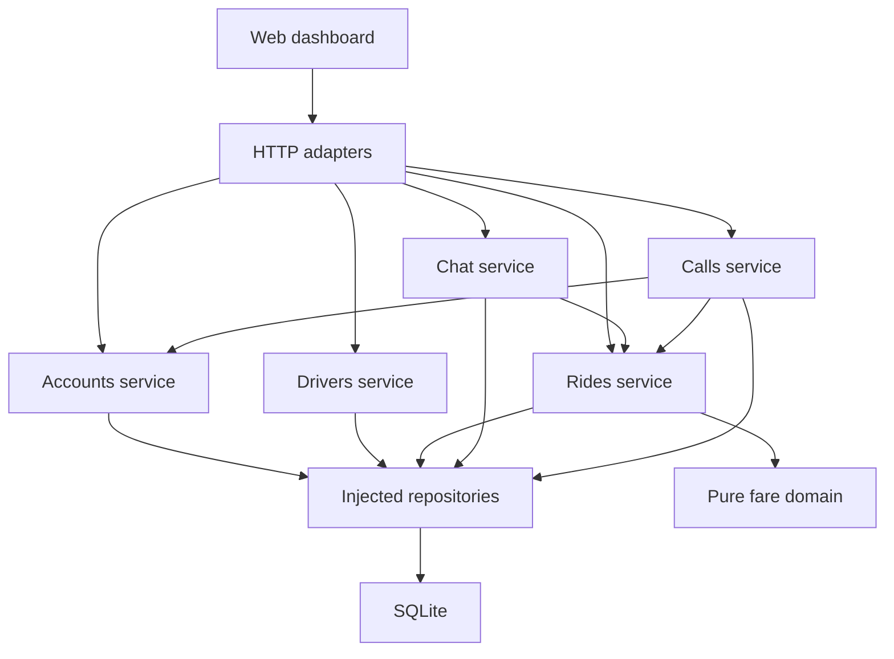

# Taxi Ai architecture

Taxi Ai uses a **modular monolith**: one backend process and database, with
separate business modules and explicit dependencies. The current code implements
accounts, driver review, ride/fare negotiation, trip lifecycle, participant chat
and audio calling. The structure supports adding Eats and courier workflows
without mixing their rules into ride logic.
See [ADR 0001](decisions/0001-modular-monolith.md) for the decision and tradeoffs.

## Implemented modules

| Module | Responsibility | Owns |
| --- | --- | --- |
| Accounts | Registration, authentication, sessions, first-admin setup, own profile | `users`, `sessions` |
| Drivers | Application profile and administrator review | `drivers` |
| Rides | Requests, fares, bookings, pickup verification, progress, cancellation and history | `rides`, `fare_events`, `idempotency`, `ride_trips`, `ride_activity` |
| Chat | Participant messages, read markers, retries and reports | `chat_messages`, `chat_reads`, `chat_commands`, `chat_reports` |
| Calls | Audio invitations, session/window ownership, signaling, expiry and history | `voice_calls`, `voice_participants`, `voice_commands` |
| Shared domain | Pure fare state machine, lifecycle vocabulary, money helpers and sample quotes | No storage or network |
| Infrastructure | SQLite, migrations, password hashing, random tokens, audit and rate limits | `audit_events`, `rate_limits`, connection lifecycle |
| HTTP | Route dispatch, request parsing, cookies, CSRF and error/status translation | No business state |

Every feature lives under `services/api/src/modules/<feature>/`:

- `service.mjs` implements use cases and authorization, receiving dependencies as
  factory arguments. It contains no SQL or HTTP objects.
- `repository.mjs` owns feature SQL and returns plain records. It participates in
  the caller's transaction and never commits independently.
- `routes.mjs` adapts HTTP inputs/results to an injected service. The shared router
  performs session, Origin/CSRF, body-size and rate-limit checks.
- `domain.mjs`, where useful, contains pure feature rules. The rides module uses
  it to check participants/versions and reconstruct the shared fare model.

`services/api/src/application.mjs` creates and connects services, repositories and
adapters. It is the only composition root. Business modules do not import one
another's internals. For example, rides receives a `getAccount(id)` port; account
registration receives driver-profile `find`/`insert` operations. The shared
transaction spans user and driver creation. Dependencies are plain functions and
objects, without a dependency-injection framework or service locator.

The runtime relationships are:

Arrows represent calls, not permission to import an implementation. The
composition root supplies dependencies. Authentication is session based; passing
a user ID from the browser never grants access to that user's account or ride.

## Commands, persistence and consistency

Requests progress from `requested` to `negotiating` to `agreed`. The customer then
confirms a booking. Its driver records on-way/arrival, starts with the pickup PIN
and completes the trip. Pre-start cancellation preserves any agreed fare.
See [the trip contract](trips.md) for availability, transitions and PIN handling.
These are test journeys; the homepage demo remains an independent in-memory example.

For each authenticated ride mutation, the service:

1. Validates the command key and begins a synchronous unit of work.
2. Reloads the actor, checks a previous key's command fingerprint, or validates
   permissions and the current ride version.
3. Applies the command using server time and the pure fare rules.
4. Writes the ride, fare event when applicable, audit event and retry key together.
5. Returns a projection only after the transaction succeeds. Persistence failures
   roll back all these writes. Incorrect PIN submissions instead commit their
   failure counter, audit reference and failed-command key before returning a
   validation error; retrying one cannot count as a second guess.

The SQLite adapter uses `BEGIN IMMEDIATE`, foreign keys and unique constraints for
one open request per customer, one active negotiation per driver and one active
trip per participant. Service checks also prevent mixing an active trip with a
new request/negotiation under the same transaction. A replayed
key returns the current saved ride; a different command with that key is rejected.
Rate-limit counters are intentionally a separate transaction so failed attempts
still count. Expensive password work runs outside transactions.

Repository operations and `unitOfWork(callback)` are synchronous contracts in
this version. Async callbacks and promise results are rejected; never schedule
background writes inside them. A future PostgreSQL adapter requires coordinated
async contract changes, migration and transaction/concurrency tests. Changing the
repository constructor alone is insufficient.

The existing `data/taxi-ai.sqlite` location is preserved. Ordered migrations
`002_chat.sql`, `003_trip_lifecycle.sql` and `004_voice_calls.sql` upgrade schemas 1–3 to 4 without resetting
records or silently booking prior agreements. Older binaries refuse the upgraded
database. Local data and secrets are excluded from Git and static serving.
See [API notes](../services/api/README.md) for routes and current security limits.

## Fare rules

`packages/shared/src/fare-negotiation.mjs` models one customer/driver pair in
`open`, `agreed` or `cancelled` state. Every mutation checks the participant and
expected version. Every counteroffer has a new offer ID. Acceptance requires the
current offer ID/version, an unexpired offer and the other person's explicit
consent. Returned snapshots are copies, not mutable internal state.

Amounts are positive safe integer kobo. Suggestions are nonbinding; sample quotes
are fictional, not an AI estimator. Server-persisted events reconstruct the fare
model; clients cannot upload snapshots or set event clocks. Ride versions also
include claiming/cancelling before a fare conversation; fare-event versions track
only the shared model. Their distinct sequences are validated separately.

The domain's `in_app`, `chat` and `voice_call` labels describe where an offer began;
they do not themselves implement communication. The current chat presents fare
cards and calls the same in-app offer/accept endpoints. Free text never changes
the fare. Voice calls also leave fares unchanged; both people must use the
existing offer/accept controls after discussing a price.

## Web and future mobile clients

The website uses native HTML/CSS/JavaScript. `apps/web/server.mjs` composes the
application/router and serves an explicit static allowlist. It remains loopback
only. At `/app`, `dashboard.mjs` coordinates page/session state and polling:

| Client module | Responsibility |
| --- | --- |
| `dashboard/api-client.mjs` | Same-origin requests, CSRF, timeout and stable retry keys |
| `dashboard/auth-form.mjs` | Login/registration form state and input collection |
| `dashboard/views.mjs` | Role-specific rendering and user action callbacks |
| `dashboard/conversation-controller.mjs` | Chat pagination, selected-account isolation and read acknowledgement |
| `dashboard/conversation-view.mjs` | Plain-text transcript, fare cards, drafts and reporting form |
| `dashboard/conversation-model.mjs` | Pure timeline and offer-card presentation rules |
| `dashboard/chat-reports-view.mjs` | Administrator view of reported messages |
| `dashboard/call-controller.mjs` | Call polling, explicit microphone consent, session isolation and cleanup |
| `dashboard/call-media.mjs` | Browser WebRTC, audio tracks and bounded ICE gathering |
| `dashboard/call-view.mjs` | Call controls, audio playback and recent call history |
| `dashboard/dom.mjs` | Small DOM helpers using text content |

Views do not call `fetch`. The client retains the displayed offer ID/version and
refreshes on a conflict; it never automatically accepts a new price. Dashboards
poll every three seconds while visible. Browser rendering/accessibility checks
remain a separate manual review, documented in the web README.

Native iOS/Android apps and tablet layouts remain planned. They should use the
same server use cases through reviewed API contracts. The current browser-cookie
transport is not a completed native authentication design. TypeScript, OpenAPI
schemas and client generation are future decisions; this code is JavaScript ESM.

## Participant chat

Chat receives account and narrow ride-membership/status ports through the
composition root, so chat polling does not replay fare history. Its
repository owns only chat tables. Send commands recheck participants inside a
transaction and commit the message, audit reference and retry key together. Read
markers advance monotonically. The dashboard discards delayed responses after
changing rides or accounts and keeps unsent drafts in memory per conversation.

The chat transcript projects fare cards from ride state; it does not duplicate
price decisions in chat storage. Administrators can review explicitly reported
messages through dedicated endpoints, without access to full conversations.
See [the chat guide](chat.md) for the API contract and development limits.

## Participant audio calls

The calls service receives account/session lookup, ride membership and a relay
configuration adapter through composition. It owns its SQL tables and changes no
fare records. The rides service receives an `onRideClosed` port that clears live
call state within the trip completion/cancellation transaction. This callback
does not start a nested transaction or call back into the rides service.

One transaction reserves both participants, binds the caller's session/window and
saves the command/audit reference. Answering binds the recipient's session/window.
Only those two windows can read or submit audio setup. Any authenticated participant
can hang up, including from a replacement window. Expiry also checks revoked
sessions and call configuration changes, and releases reservations and temporary
SDP. Metadata history survives restart; media never lives in the database.

The browser adapter uses WebRTC audio with a single offer/answer and fully gathered
ICE candidates. HTTP polling supplies signaling only; browser peers or the TURN
relay carry audio. `call-config.mjs` defaults to local testing without external
ICE services. Relay mode creates short-lived coturn credentials, and requires relay
candidates. No TURN service is provisioned. See [the voice contract](voice.md).

## Adding planned features

| Future module | Boundary to preserve |
| --- | --- |
| Production communication | Operated TURN infrastructure, cross-network/mobile validation, push notifications and abuse controls |
| Taxi Ai Eats | Vendors, fixed-price menus, ordering and fulfilment; show delivery fees at checkout |
| Courier | Parcel details, vehicle eligibility and proof of delivery; confirm its pricing policy separately |
| Payments | Provider adapters, payment states, verified webhooks and provider idempotency |
| AI assistance | Fare/ETA suggestions and authorized assistance through explicit application commands |

Create modules when implementing these workflows, without empty service shells.
Motorcycles belong to food/small-parcel delivery; passenger rides use cars. Larger
courier jobs can use suitable cars/vans. Autonomous taxis remain **Coming soon**;
the site does not imply an operational fleet or a launch date.

Provision and validate a relay before a public calling pilot. Keep application IDs
in peer payloads, add report/block controls and require an explicit consent design
for any future recording/transcription. The TURN shared secret remains in the
server adapter. AI may assist discovery/support; it must not independently
accept fares, authorize charges or change safety permissions.

## Enforced conventions and deployment limits

`npm run check` checks syntax, missing imports, dependency direction, cycles and
our SQL/network placement conventions. It assumes static ESM imports and uses a
small convention checker, not a complete JavaScript parser or a security sandbox.
`npm run verify` adds domain, API client, HTTP and persistence tests. GitHub Actions
runs the same command on Node 22.12.0 and Node 24 for pushes and pull requests.

A modular structure is a maintainability foundation, not production readiness.
Before real bookings, implement verified onboarding/account recovery, HTTPS and
production session operations, database backup/restore and retention, deployment
monitoring and measured concurrency/scale. Actual dispatch, production trip
safety operations, maps and payments are additional product milestones. Current
administrator approval grants local test access only, not document verification.
